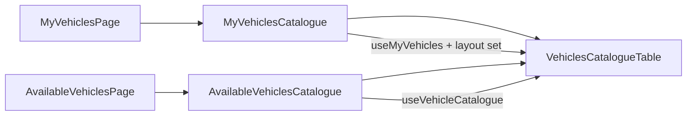

# Uwspólnienie tabeli pojazdów + nowy układ wiersza

**Status:** zrealizowano (2026-08-07)

## Zakres
Tylko pojazdy (`MyVehiclesCatalogue` / `AvailableVehiclesCatalogue`). Składy i `RosterSection` na dashboardzie bez zmian.

## Podejście
Jeden wspólny komponent tabeli wyciągnięty ze struktury **Dostępne pojazdy** (wyszukiwanie, paginacja, Paper, Alert błędów mutacji). Strona **Moje pojazdy** używa tego samego komponentu z danymi własnych pojazdów (oraz dotychczasowymi akcjami: Dodaj/Odśwież w nagłówku, przycisk funkcji).



Zachowanie danych bez zmian:
- **Moje:** `useMyVehicles()` + `useLayoutVehicles(layoutId)` do statusu na makiecie.
- **Dostępne:** `useVehicleCatalogue(layoutId)` z polem `onLayout`.
- Uprawnienia i zestaw przycisków pozostają w cienkich wrapperach / slotach.

## Nowy układ wiersza

Zamiast wielu kolumn (`Name | Number | DCC | OnLayout | Actions`) — **2 komórki**:

| Lewa | Prawa |
|------|-------|
| Nazwa (tooltip z id) | **Górny podwiersz:** numer + chip statusu na makiecie (Available) |
| Adres DCC w formacie `DCC: {num}` / chip Dummy | **Dolny podwiersz:** IconButtony (add/remove, lend, functions?, edit, delete) |
| Opcjonalnie caption właściciela (Available) | |

Technicznie: jedna `TableRow` z dwoma `TableCell`; prawa komórka to `Stack` z dwoma poziomymi `Stack`ami (attributes / actions). Nagłówek: „Pojazd” / „Szczegóły”.

## Zrealizowane pliki

- Nowy: `bigfred/web/src/components/vehicles/VehiclesCatalogueTable.tsx` — shell (Paper, search+pagination, loading/empty) + wiersz 2-kolumnowy.
- Przerobione: `MyVehiclesCatalogue.tsx`, `AvailableVehiclesCatalogue.tsx`.
- i18n: `vehicle.json` (pl/en/de) — `catalogue.table.*`, `catalogue.dccLabel`, dłuższe etykiety `onLayout.yes` / `onLayout.no`.

## Follow-upy po implementacji

- Chip: „Na makiecie” / „Nie jest na makiecie” (zamiast Tak/Nie).
- Adres DCC: `DCC: {{addr}}` (`catalogue.dccLabel`).

## API wspólnego komponentu

```tsx
type VehiclesCatalogueTableProps = {
  rows: Array<{
    id: string;
    name: string;
    number: string;
    dccAddress: number | null;
    onLayout: boolean;
    ownerLabel?: string; // Available only
  }>;
  loading: boolean;
  mutationError?: string | null;
  showSearch?: boolean;
  headerExtra?: ReactNode;
  emptyLabel: string;
  renderActions: (row) => ReactNode;
};
```

Na **Moje** `showSearch` włączone (wyszukiwanie lokalne).

## Poza zakresem
- Składy (`MyTrainsCatalogue` / `AvailableTrainsCatalogue`)
- Dashboard `RosterSection`
- Zmiany backendu / endpointów
