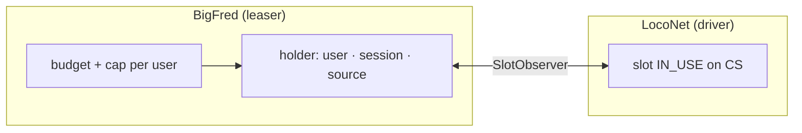

# slotlease

LocoNet slot occupancy policy in dcc-bus. The **Leaser** keeps the ledger of
who is driving which address and enforces limits; the **LocoNet driver**
physically acquires and releases slots on the command station.

Full specification: [`perf-and-speed1-regression.md`](../../../../../../docs/content/en/specs/bigfred/plans/perf-and-speed1-regression.md) §5.

## How it works

1. **Driver selects a loco** (`loco.select` / first Z21 drive) → the leaser
   records a **holder** and may call `AcquireSlot`.
2. **First throttle movement** (`setSpeed`) → leaser `Reserve` (idempotent);
   the driver calls `acquireSlot` when sending SPD.
3. Driver confirms **`OnSlotInUse`** → the lease gets `acquiredAt` (counts
   toward the budget).
4. **End of driving** (deselect, session close, remote idle) → e-stop, then
   `ReleaseSlot`.

**Subscribe without select does not occupy a slot** — view-only from store/Redis.

Exclusive vs piggyback LocoNet acquisition (`allocatePhysicalSlots` on the
command station, default on) is enforced in the **LocoNet driver**, not the
leaser. When on, `AcquireSlot` returns `ErrSlotInUse` if another throttle
already holds the loco; the leaser drops the holder on that error (same as
`ErrNoFreeSlot`).

## Reserve vs Select

| | `Reserve` | `Select` |
|---|-----------|----------|
| Slot on command station | driver on `SetSpeed` | immediate `AcquireSlot` |
| Called by | `set_speed` | `loco.select`, handset, Z21 |

## Limits

- **Per user** (`max_vehicles_per_user`, default 8) — how many locos a user
  may drive at once.
- **CS budget** (`max_loconet_slots`, default 80) — how many slots are
  **physically IN_USE** on the command station (including grace and `external`
  observer leases). A bare `select` without driving does not count until the
  slot is reported on the station.

## Switcher (A→B→A)

`DeselectDeferred` drops the holder but keeps the slot IN_USE for **60 s**
(grace) so returning to A does not require another acquire. After the window,
`SweepDeferred` performs a full release.

When the budget is full (D20), the leaser may **forcibly release** up to five
newest grace leases (newest `releaseAt` first) before refusing a new slot
(`bigfred_slot_budget_exceeded`). Metric:
`slot_released_total{reason="grace_evict"}`.

## Reconciliation and admin release

- **`ReconcileSlots`** (every 60 s, LocoNet only) probes up to **16** leased
  addresses per cycle against the command station; drops bookkeeping when the
  CS reports the slot is no longer IN_USE (`reason=reconcile`). Does not
  release slots still IN_USE (safe for physical FREDs).
- **`ForceRelease`** from the admin slots diagnostics UI e-stops and releases
  a chosen address (`reason=admin_manual`).
- **E-stop** paths use a no-observe slot acquire so they do not create
  synthetic `external` leases.

Full plan: [`slot-allocation-unification.md`](../../../../../../docs/content/en/specs/bigfred/plans/slot-allocation-unification.md).

## Files

`leaser.go` — logic · `diagnostic.go` — admin snapshot · `metrics.go` ·
`reason.go` · `errors.go`
